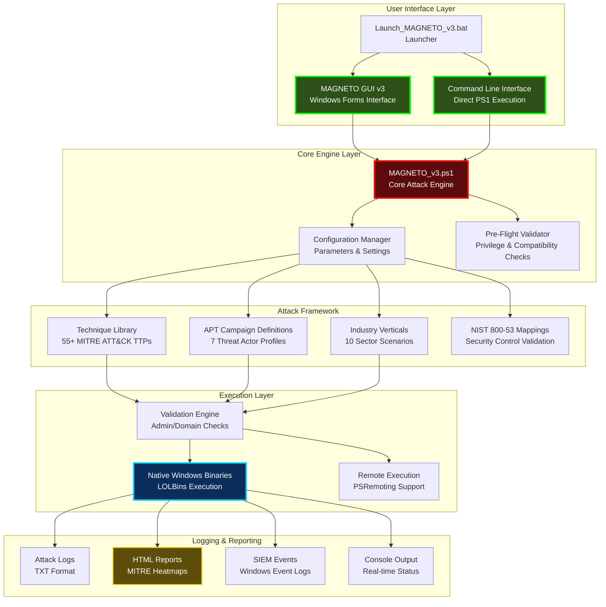
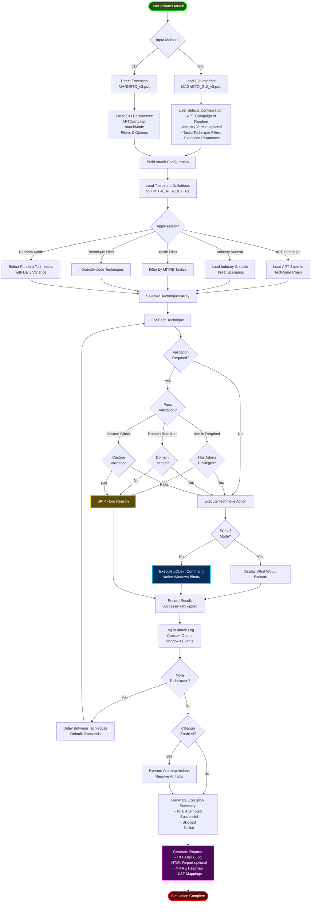
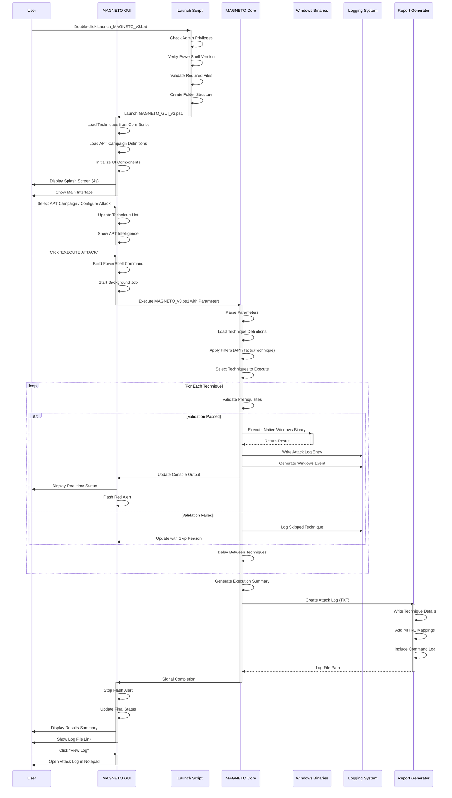
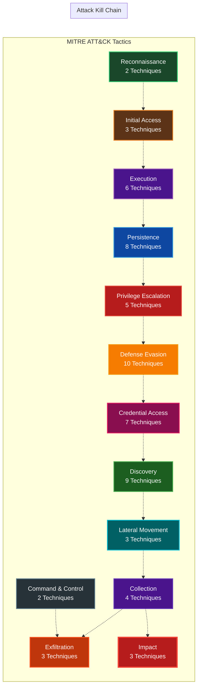
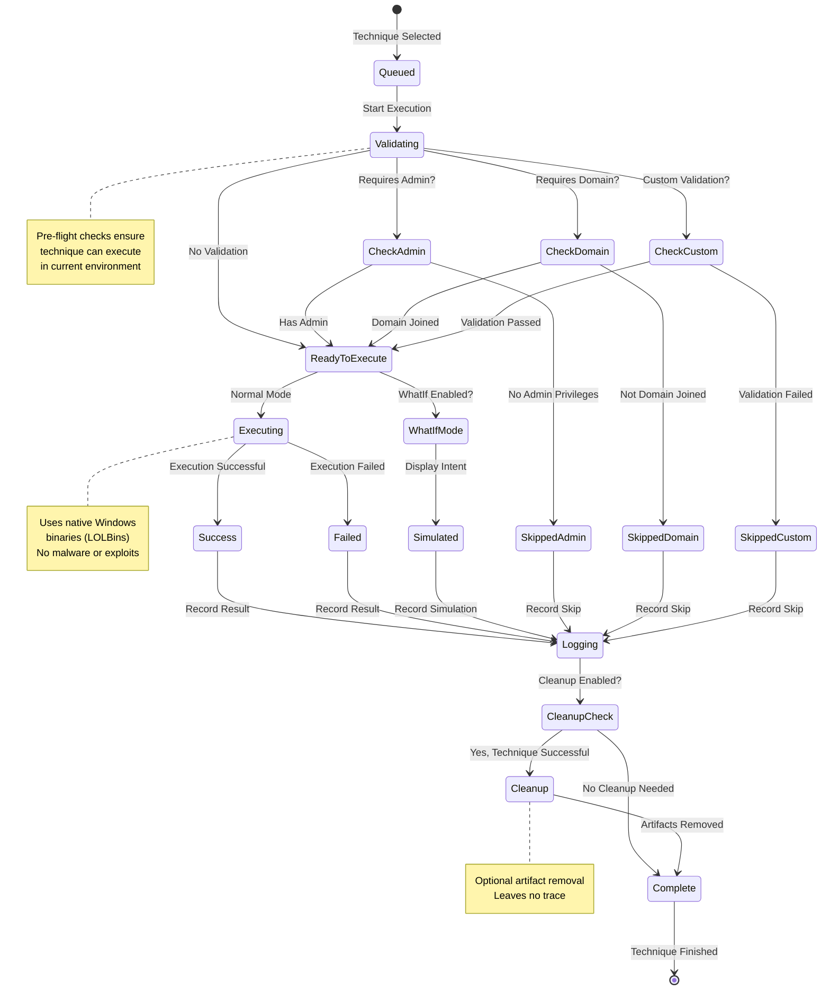
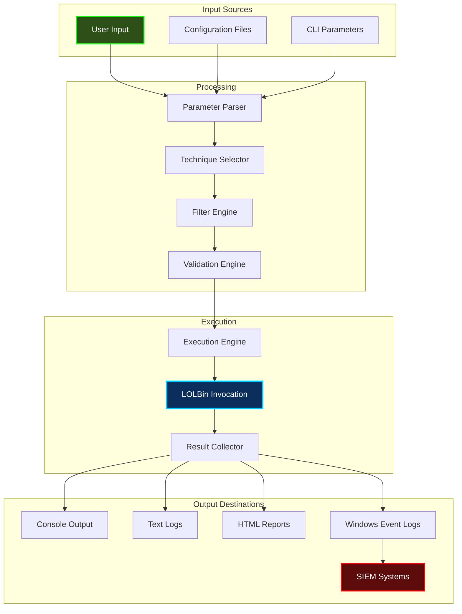
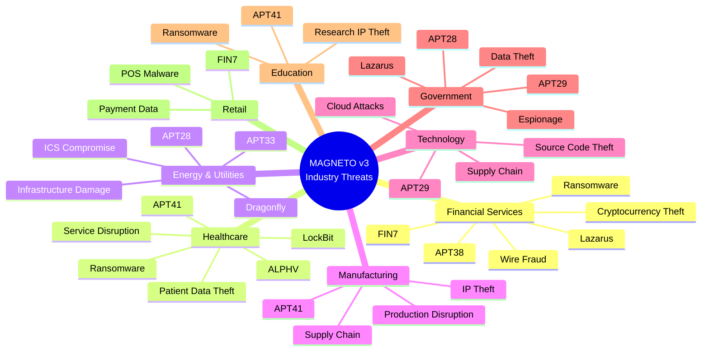
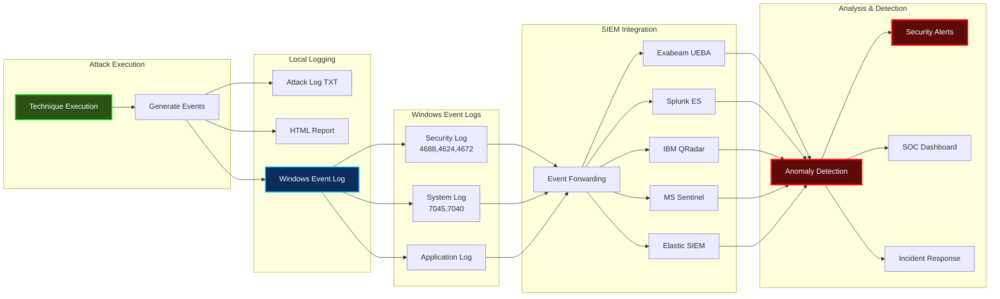

# MAGNETO v3 - Architecture Diagrams

This document contains architectural diagrams for the MAGNETO v3 Attack Simulation Framework.

## 1. System Architecture Overview

## 2. Attack Execution Flow

## 3. GUI to Core Interaction

## 4. MITRE ATT&CK Tactic Coverage

## 5. APT Campaign Attack Chains

```mermaid
graph TD
    subgraph "APT41 - Shadow Harvest"
        A1[T1049<br/>Network Discovery] --> A2[T1087.001<br/>Domain Account Enum]
        A2 --> A3[T1218.011<br/>Rundll32 Proxy]
        A3 --> A4[T1546.015<br/>COM Hijacking]
        A4 --> A5[T1055.100<br/>Process Injection]
        A5 --> A6[T1550.002<br/>Pass-the-Hash]
        A6 --> A7[T1021.002<br/>SMB Lateral Movement]
        A7 --> A8[T1041<br/>Web Service Exfil]
    end
    
    subgraph "Lazarus - DEV#POPPER"
        L1[T1574.002<br/>DLL Side-Loading] --> L2[T1053.005<br/>Scheduled Task]
        L2 --> L3[T1003.003<br/>NTDS Dumping]
        L3 --> L4[T1021.002<br/>SMB Movement]
        L4 --> L5[T1560.002<br/>Archive Collection]
    end
    
    subgraph "APT29 - GRAPELOADER"
        P1[T1546.015<br/>COM Hijacking] --> P2[T1053.005<br/>Scheduled Task]
        P2 --> P3[T1134.001<br/>Token Manipulation]
        P3 --> P4[T1070.004<br/>File Deletion]
    end
    
    subgraph "FIN7 - Carbanak"
        F1[T1059.001<br/>PowerShell] --> F2[T1105<br/>File Download]
        F2 --> F3[T1543.003<br/>Service Persistence]
    end
    
    style A8 fill:#5c0a0a,stroke:#ff0000,stroke-width:3px,color:#fff
    style L5 fill:#5c0a0a,stroke:#ff0000,stroke-width:3px,color:#fff
    style P4 fill:#5c0a0a,stroke:#ff0000,stroke-width:3px,color:#fff
    style F3 fill:#5c0a0a,stroke:#ff0000,stroke-width:3px,color:#fff
```

## 6. Technique Execution Lifecycle

## 7. Data Flow Architecture

## 8. Industry Vertical Threat Mapping

## 9. Logging and Monitoring Architecture

---

## Diagram Usage Notes

### Viewing Diagrams
- These Mermaid diagrams render automatically on GitHub
- For local viewing, use:
  - VS Code with Mermaid extension
  - Online viewer: https://mermaid.live
  - Markdown preview tools with Mermaid support

### Color Coding Legend
- 🟢 **Green**: User interfaces, input sources, successful operations
- 🔴 **Red**: Critical operations, attack execution, alerts
- 🔵 **Blue**: Core processing, execution engines
- 🟡 **Yellow**: Warnings, skipped operations
- 🟣 **Purple**: Reporting, output generation

### Diagram Categories
1. **Architecture** - System component relationships
2. **Flow** - Process execution sequences
3. **Sequence** - Component interactions over time
4. **State** - Technique lifecycle states
5. **Mind Map** - Threat landscape overview

---

*For implementation details, refer to the source code and README.md*
