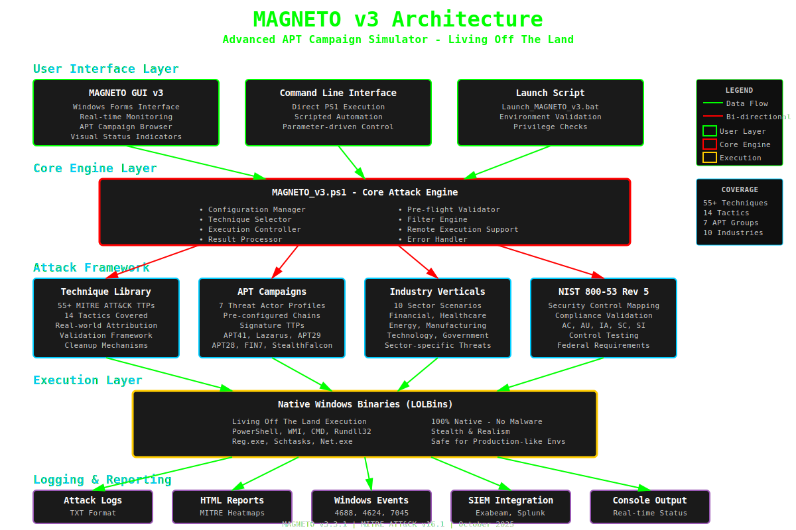

# MAGNETO v3 Documentation Package

This folder contains comprehensive documentation for your MAGNETO v3 project.

## 📄 Files Included

### 1. README.md
**Primary documentation file for GitHub**
- Complete project overview and features
- Installation and setup instructions
- Usage examples (GUI and CLI)
- APT campaign details with real-world context
- Industry vertical simulations
- MITRE ATT&CK coverage details
- Technical specifications
- Safety and ethical guidelines

**Use this as**: Your main `README.md` file in the GitHub repository root

---

### 2. ARCHITECTURE.md
**Technical architecture diagrams and flows**
- System architecture overview (Mermaid diagrams)
- Attack execution flow
- GUI to Core interaction sequence
- MITRE ATT&CK tactic coverage visualization
- APT campaign attack chains
- Technique execution lifecycle
- Data flow architecture
- Industry vertical threat mapping
- Logging and monitoring architecture

**Use this as**: 
- Additional documentation file `ARCHITECTURE.md` in your repo
- Reference for developers and security analysts
- Visual aid for presentations

**Note**: GitHub renders Mermaid diagrams automatically!

---

### 3. architecture-diagram.svg
**High-level visual architecture diagram**
- Clean, professional SVG format
- Shows all layers (UI, Core, Framework, Execution, Logging)
- Color-coded components
- Data flow indicators
- Coverage statistics
- Legend included

**Use this as**:
- Visual asset for presentations
- GitHub README header image
- Documentation illustrations
- Marketing materials

**To display in README.md**:
```markdown

```

---

## 🚀 Quick Setup Guide

### Step 1: Copy to GitHub Repository
```bash
# Copy README.md to repository root
cp README.md /path/to/your/repo/

# Copy architecture documentation
cp ARCHITECTURE.md /path/to/your/repo/

# Create docs folder (optional)
mkdir /path/to/your/repo/docs
cp architecture-diagram.svg /path/to/your/repo/docs/
```

### Step 2: Update README.md (Optional)
Add the architecture diagram to your README:
```markdown
## Architecture


For detailed architectural documentation, see [ARCHITECTURE.md](./ARCHITECTURE.md)
```

### Step 3: Commit to GitHub
```bash
git add README.md ARCHITECTURE.md docs/architecture-diagram.svg
git commit -m "Add comprehensive documentation and architecture diagrams"
git push origin main
```

---

## 📋 Documentation Features

### README.md Highlights
✅ **Professional formatting** with badges and shields  
✅ **Comprehensive coverage** of all 55+ techniques  
✅ **Real APT intelligence** for all 7 threat actors  
✅ **Industry-specific scenarios** for 10 verticals  
✅ **Complete usage examples** (GUI + CLI)  
✅ **Safety guidelines** and ethical considerations  
✅ **NIST 800-53** security control mappings  
✅ **SIEM integration** guidance  
✅ **Quick links** to MITRE, NIST, and other resources  

### ARCHITECTURE.md Highlights
✅ **9 interactive diagrams** (Mermaid format)  
✅ **Auto-rendering** on GitHub  
✅ **Multiple views**: Architecture, flow, sequence, state  
✅ **Color-coded** for easy understanding  
✅ **Detailed annotations** explaining each component  

### architecture-diagram.svg Highlights
✅ **High-quality vector graphics** (scales to any size)  
✅ **Professional design** with cybersecurity theme  
✅ **Matrix green color scheme** matching MAGNETO branding  
✅ **Includes legend and statistics**  
✅ **Ready for presentations** and documentation  

---

## 🎨 Customization Tips

### Personalizing README.md
1. **Add your GitHub username** in badge URLs
2. **Update repository URL** in support section
3. **Add screenshots** of your GUI (if desired)
4. **Include your contact** information
5. **Add contributors** section if applicable

### Enhancing ARCHITECTURE.md
1. **Add deployment diagrams** for your specific environment
2. **Include network topology** if relevant
3. **Add screenshots** of actual executions
4. **Document custom techniques** you've added
5. **Include performance metrics** from your tests

### Using the SVG Diagram
1. **Change colors** to match your branding (edit SVG XML)
2. **Add your logo** to the diagram
3. **Export to PNG** for PowerPoint presentations
4. **Scale for different** uses (email signature, headers, etc.)

---

## 📊 Documentation Structure Recommendation

Recommended GitHub repository structure:
```
Magneto3/
├── README.md                    ← Main documentation
├── ARCHITECTURE.md              ← Technical architecture
├── LICENSE                      ← Add your license
├── .gitignore                   ← Ignore logs and artifacts
│
├── docs/                        ← Additional documentation
│   ├── architecture-diagram.svg
│   ├── CONTRIBUTING.md          ← Contribution guidelines
│   ├── SECURITY.md              ← Security policy
│   └── CHANGELOG.md             ← Version history
│
├── Launch_MAGNETO_v3.bat       ← Launcher script
├── MAGNETO_v3.ps1              ← Core engine
├── MAGNETO_GUI_v3.ps1          ← GUI interface
│
├── Logs/                        ← Log output (git ignored)
│   ├── Attack Logs/
│   └── GUI Logs/
│
├── Reports/                     ← Report output (git ignored)
│
├── nist_mappings/              ← NIST module (if included)
│   └── nist_mapping_module.ps1
│
└── examples/                    ← Usage examples
    ├── example-apt41-run.ps1
    ├── example-financial-scenario.ps1
    └── example-random-attack.ps1
```

---

## 🔗 Additional Resources

### Recommended Additions
Consider creating these additional docs:

1. **CONTRIBUTING.md** - Guidelines for contributors
2. **SECURITY.md** - Security policy and reporting
3. **CHANGELOG.md** - Version history and updates
4. **EXAMPLES.md** - Detailed usage scenarios
5. **FAQ.md** - Frequently asked questions
6. **TROUBLESHOOTING.md** - Common issues and solutions

### GitHub Features to Enable
- **GitHub Pages** - Host documentation website
- **Wiki** - Detailed technique documentation
- **Issues** - Bug tracking and feature requests
- **Discussions** - Community Q&A
- **Projects** - Roadmap and task tracking
- **Actions** - Automated testing (if applicable)

---

## 📝 Content Summary

### Key Statistics Documented
- **55+ MITRE ATT&CK techniques** spanning 14 tactics
- **7 APT campaign simulations** with real-world attribution
- **10 industry vertical scenarios** for sector-specific testing
- **100% LOLBin-based** execution (no malware)
- **NIST 800-53 Rev 5** compliance mapping
- **Multiple SIEM integrations** (Exabeam, Splunk, QRadar, etc.)

### APT Groups Covered
1. **APT41** - Shadow Harvest (Chinese MSS)
2. **Lazarus** - DEV#POPPER (North Korean RGR)
3. **APT29** - GRAPELOADER (Russian SVR)
4. **APT28** - Fancy Bear (Russian GRU)
5. **FIN7** - Carbanak (Financial Cybercrime)
6. **StealthFalcon** - Project Raven (UAE Intelligence)
7. **Custom** - Your own campaigns

### Industry Verticals Covered
1. Financial Services & Banking
2. Healthcare & Hospitals
3. Energy, Oil & Gas, Utilities
4. Manufacturing & OT/ICS
5. Technology & Software
6. Government & Defense
7. Education & Academia
8. Retail & Hospitality
9. Telecommunications
10. Legal & Professional Services

---

## ✅ Quality Checklist

Before publishing, verify:
- [ ] README.md has correct repository URLs
- [ ] All badges display correctly
- [ ] ARCHITECTURE.md diagrams render on GitHub
- [ ] SVG diagram displays properly
- [ ] No sensitive information in documentation
- [ ] All code examples are tested
- [ ] Links to external resources work
- [ ] Version numbers are current
- [ ] Contact information is accurate
- [ ] License file is included

---

## 🎯 Marketing Highlights

Use these talking points:
- **"Living Off The Land"** - 100% native Windows binaries
- **"100% REAL | 100% SAFE"** - Authentic attacks, zero risk
- **Real APT Simulation** - Not just theory, actual threat actor TTPs
- **MITRE ATT&CK v16.1** - Current framework compatibility
- **Enterprise-Grade** - Built for SIEM/UEBA validation
- **GUI + CLI** - Flexible execution options
- **Compliance Ready** - NIST 800-53 Rev 5 mappings
- **Battle-Tested** - Used for Exabeam UEBA testing

---

## 📞 Support Information

Include in your README:
- GitHub Issues for bug reports
- Discussions for Q&A
- Email for security concerns
- LinkedIn/Twitter for updates
- Professional consulting services (if offered)

---

## 🏆 Best Practices

### Documentation Maintenance
1. **Update regularly** with new features
2. **Keep examples current** and tested
3. **Respond to issues** and questions
4. **Version documentation** with releases
5. **Include screenshots** of UI updates

### Community Engagement
1. **Welcome contributions** with clear guidelines
2. **Acknowledge contributors** in README
3. **Maintain changelog** for transparency
4. **Respond to feedback** professionally
5. **Share updates** on social media

---

**Your documentation is now complete and professional!**

Ready to push to GitHub and share with the cybersecurity community. 🚀

---

*Generated with ❤️ for the MAGNETO v3 project*
*Date: October 28, 2025*
